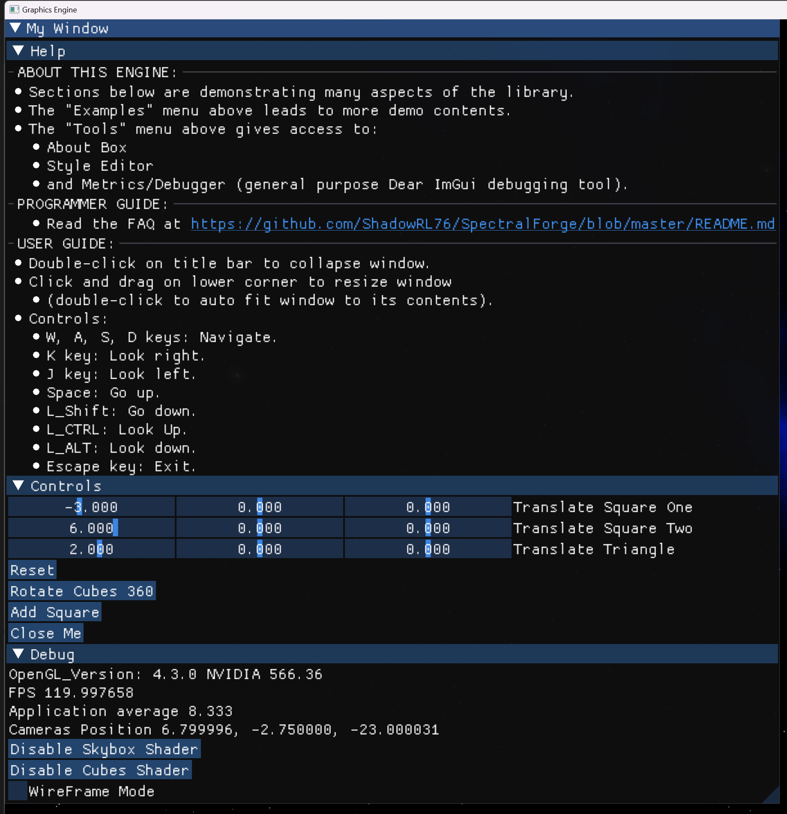
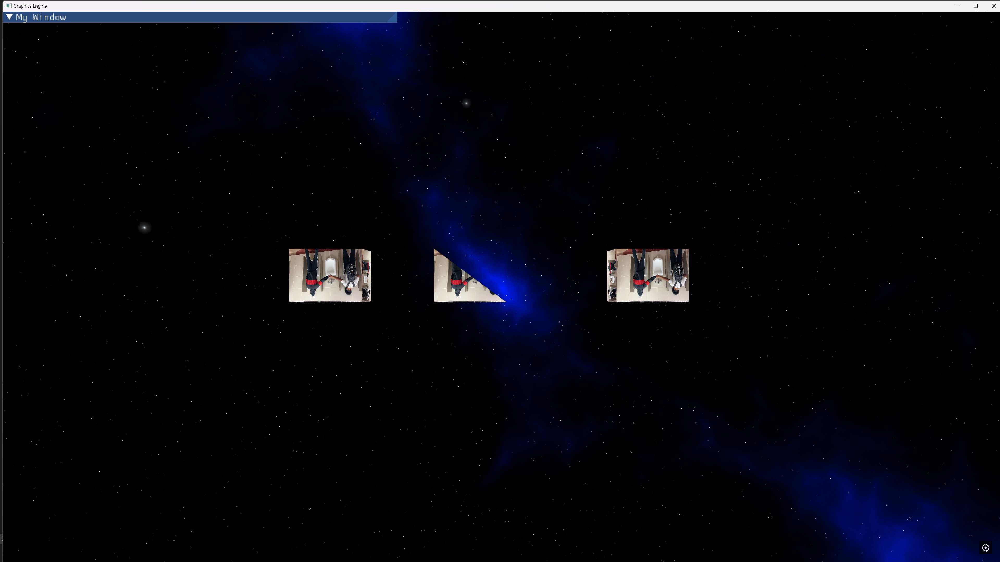
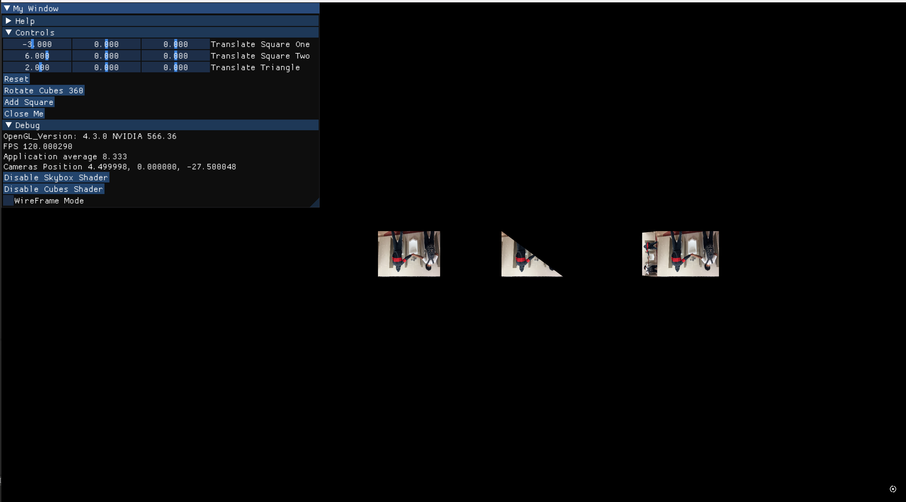
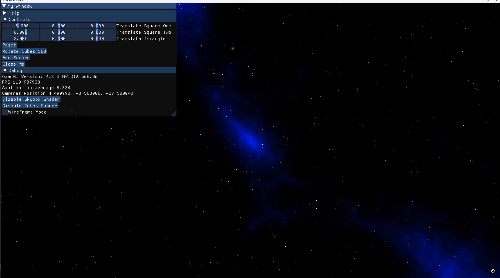

# Badiya

## Overview

Badiya is an in-progress graphics engine built using C++, OpenGL, GLFW, and ImGui. This project is created for fun and learning purposes, demonstrating the creation and management of OpenGL windows, rendering of 3D objects, and integration with ImGui for UI rendering. The ultimate goal is to develop a powerful terrain generator with an intuitive GUI for creating beautiful landscapes, but for now, it serves as a learning experience.

---

---

## Features

- Window management using GLFW
- OpenGL context initialization and management
- Rendering of 3D objects (cubes and triangles)
- Camera controls
- ImGui integration for UI rendering
- Future Goal: Advanced terrain generation with a user-friendly interface

---

## Prerequisites

- C++20 or later
- Premake
- OpenGL
- GLFW
- GLEW
- ImGui

---

Stay tuned for updates as Badiya evolves into a fully-fledged terrain generation tool!

