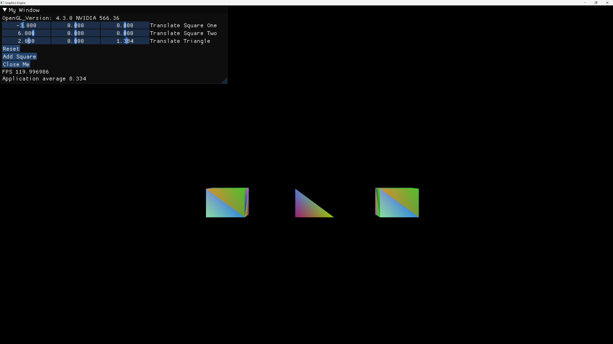

# SpectralForge 

## Overview

SpectralForge is an in-progress graphics engine built using C++, OpenGL, GLFW, and ImGui. This project is created for fun and learning purposes, demonstrating the creation and management of OpenGL windows, rendering of 3D objects, and integration with ImGui for UI rendering.

---

---

## Features
- Window management using GLFW
- OpenGL context initialization and management
- Rendering of 3D objects (cubes and triangles)
- Camera controls
- ImGui integration for UI rendering
---

## Prerequisites
- C++17 or later
- CMake 3.10 or later
- OpenGL
- GLFW
- GLEW
- ImGui
